# Network-Threat-Detection-and-Prevention-with-Suricata-and-Wazuh

This project documents the design, setup, and testing of a network-based threat detection and prevention lab using Suricata IDS/IPS, Wazuh SIEM. The objective is to simulate real-world threats and verify the detection and prevention mechanism

## Project Overview
The goal of this lab is to build a modular network security environment, where:

- Suricata monitors and blocks malicious traffic at the network layer (IDS/IPS)
- Wazuh aggregates logs and detects incidents

The lab replicates SOC-level visibility and allows testing against simulated attacks from Kali Linux.

## 🔍 Project Goals  

- Deploy Suricata as an IPS gateway
- Route all DMZ traffic through Suricata
- Enable Suricata log forwarding to Wazuh
- Create custom Suricata rules (detection + blocking)
- Test existing rules and custom rules using Kali Linux

📷 **Lab Diagrame** 

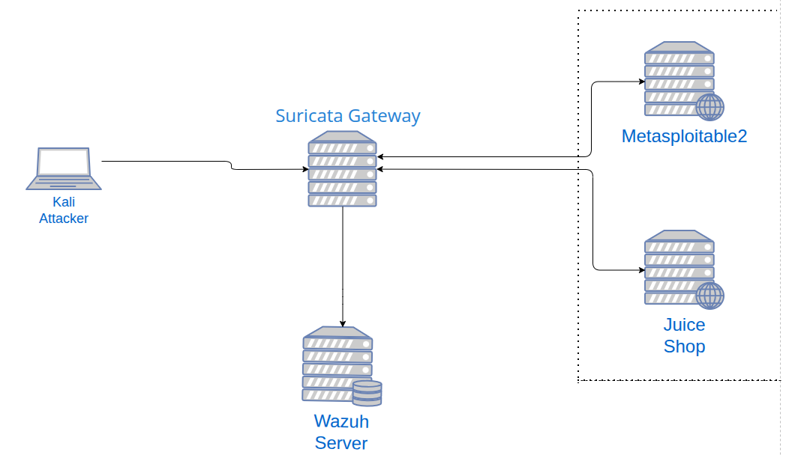 
  
## 🧪 Tools and Technologies

| Component         | Role                                   |
| ----------------- | -------------------------------------- |
| Debian 12         | Used for Suricata Gateway              |
| Suricata          | IDS/IPS engine                         |
| IPTables          | Routing & NFQUEUE integration          |
| OWASP Juice Shop  | Web application in DMZ                 |
| Wazuh Server      | Log aggregation & alerting             |
| Kali Linux        | Attacker VM                            |
| Metasploitable2   | Additional vulnerable services in DMZ  |

## 🧩 Key Steps

### 1. Lab VM Setup
- 3 Virtual Machines:
  - Suricata Gateway
  - Web Server ([Juice Shop](https://github.com/juice-shop/juice-shop) on Debian 12)
  - Vulnerable Host ([Metasploitable 2](https://sourceforge.net/projects/metasploitable/))
- 1 Kali Linux VM for attack simulation
- 1 Wazuh server (already set up [here](https://github.com/Apelsyn582/Wazuh-SIEM-Home-Lab-Detection-of-Suspicious-Activities/tree/main?tab=readme-ov-file#wazuh-siem-home-lab--detection-and-prevention-of-suspicious-activities))

### 2. IPTables and Network Routing
- Debian Suricata machine set up as gateway with 2 NICs:
  - enp0s3 — WAN (LAN side)
  - enp0s8 — DMZ interface
- Configured IP forwarding and NAT
- Configured iptables to forward DMZ traffic

📄[View the Report here](https://github.com/Apelsyn582/Network-Threat-Detection-and-Prevention-with-Suricata-and-Wazuh/blob/main/Full%20Step-by-Step%20Instruction%20for%20step%202.pdf)

### 3. Suricata Installation and Integration in Wazuh

##### Wazuh was installed and configured in [this](https://github.com/Apelsyn582/Wazuh-SIEM-Home-Lab-Detection-of-Suspicious-Activities/tree/main?tab=readme-ov-file#wazuh-siem-home-lab--detection-and-prevention-of-suspicious-activities) lab
- Installed and configured Suricata
- Installed Wazuh agent on Suricata Gateway
- Create two custom rules to prevent Syn Scan Technique and Brute-force attack against Web app

📄[All this steps you can check here](https://github.com/Apelsyn582/Network-Threat-Detection-and-Prevention-with-Suricata-and-Wazuh/blob/main/Suricata%20Installation%20and%20Integration%20with%20Wazuh.pdf)

### 6. Attack Simulation - Rules Testing with Kali
Ran:
- Nmap scans
- Nikto
- SQLMap
- Brute-force with Hydra
Verified detections in:
- Wazuh dashboard

  ### Here is all attacks and alerts on it:
  #### ➤ Perform a full port scan on the host at 192.168.100.3(Metasploitable 2) and detect service versions.
  
    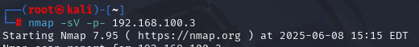
    Find hidden or non-standard services and fingerprint versions for vulnerability assessment.
    Here is alerts in Wazuh:
  
    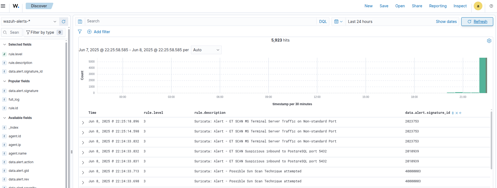

    Two rules were triggered:
      - 2023753 is from emerging-scan.rules that is comunity rules
      - 40000003 is my custom rule
 
  #### ➤ Scan the entire subnet to identify hosts and guess their operating systems.

    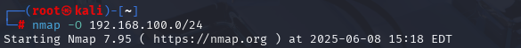
  
    Here is alerts in Wazuh:

    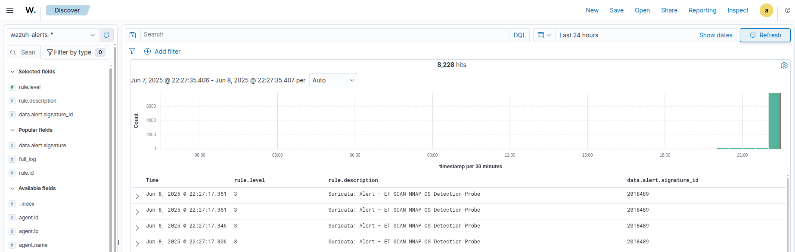
  
    you can see the alert of rule 2018489 that is from emerging-scan.rules that is comunity rules

  #### ➤ Perform a SQL injection attack on DVWA(That is on Metasploitable 2) using an authenticated session.
  
    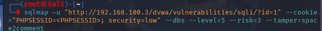
  
    Here is alerts in Wazuh:

    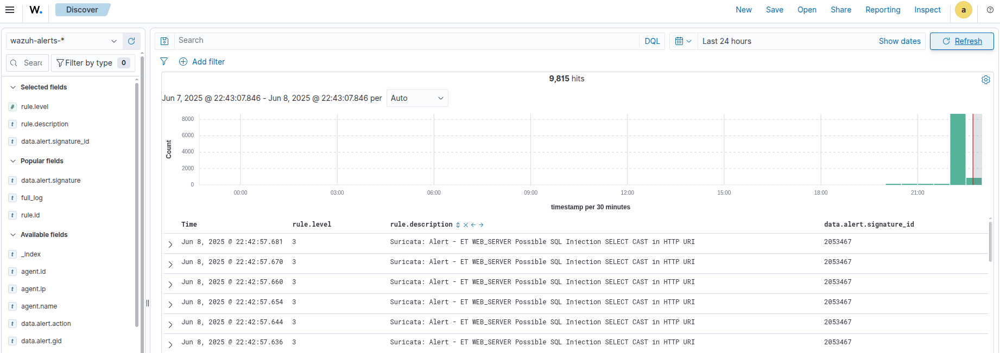

    you can see the alert of rule 2053467 that is from emerging-sql.rules that is comunity rules

  #### ➤ Brute-force login credentials for DVWA using the username admin and a password list.

    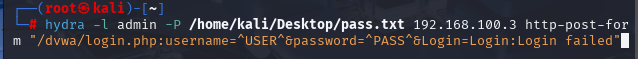

    Here is alerts in Wazuh:

    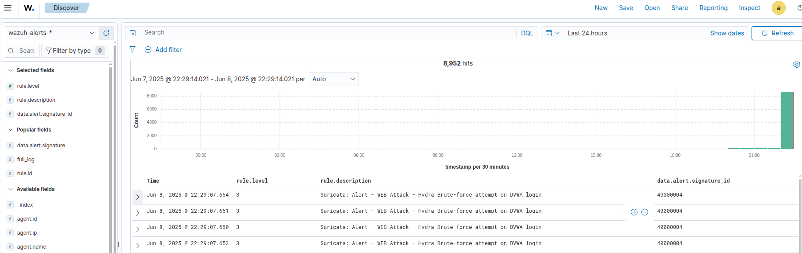

    40000004 is my custom rule:

    

  #### ➤ Scan the web server at 192.168.100.2( OWASP Juice Shop ) for common vulnerabilities and misconfigurations.
  
   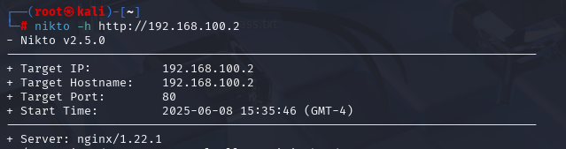

    Here is alerts in Wazuh:

    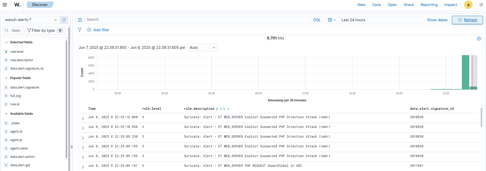

   Here is all allerts triggered by nikto scan:

   | alert             | attack type                            |
   | ----------------- | -------------------------------------- |
   | cmd=              | PHP Code Injection                     |
   | /msadc/           | Old IIS Exploit                        |
   | iissamples        | Sample Web Apps (IIS)                  |
   | /etc/passwd       | Directory Traversal                    |
   | <script>          | XSS                                    |
   | cmd.exe           | RCE Attempt                            |
   | viewcode          | Info Disclosure                        |

    Source of rules is from emerging-web-server.rules that is comunity rules

  

### 7. Conclusion
????????????

