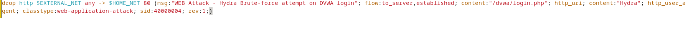

# Network-Threat-Detection-and-Prevention-with-Suricata-and-Wazuh

This project documents the design, setup, and testing of a network-based threat detection and prevention lab using Suricata IDS/IPS, Wazuh SIEM. The objective is to simulate real-world threats and verify the detection and prevention mechanism

## Project Overview
The goal of this lab is to build a modular network security environment, where:

- Suricata monitors and blocks malicious traffic at the network layer (IDS/IPS)
- Wazuh aggregates logs and detects incidents

The lab replicates SOC-level visibility and allows testing against simulated attacks from Kali Linux.

## 🔍 Project Goals  

- Deploy Suricata as an IPS gateway
- Route all DMZ traffic through Suricata
- Enable Suricata log forwarding to Wazuh
- Create custom Suricata rules (detection + blocking)
- Test existing rules and custom rules using Kali Linux

📷 **Lab Diagrame** 

  
## 🧪 Tools and Technologies

| Component         | Role                                   |
| ----------------- | -------------------------------------- |
| Debian 12         | Used for Suricata Gateway              |
| Suricata          | IDS/IPS engine                         |
| IPTables          | Routing & NFQUEUE integration          |
| OWASP Juice Shop  | Web application in DMZ                 |
| Wazuh Server      | Log aggregation & alerting             |
| Kali Linux        | Attacker VM                            |
| Metasploitable2   | Additional vulnerable services in DMZ  |

## 🧩 Key Steps

### 1. Lab VM Setup
- 3 Virtual Machines:
  - Suricata Gateway
  - Web Server ([Juice Shop](https://github.com/juice-shop/juice-shop) on Debian 12)
  - Vulnerable Host ([Metasploitable 2](https://sourceforge.net/projects/metasploitable/))
- 1 Kali Linux VM for attack simulation
- 1 Wazuh server (already set up [here](https://github.com/Apelsyn582/Wazuh-SIEM-Home-Lab-Detection-of-Suspicious-Activities/tree/main?tab=readme-ov-file#wazuh-siem-home-lab--detection-and-prevention-of-suspicious-activities))

### 2. IPTables and Network Routing
- Debian Suricata machine set up as gateway with 2 NICs:
  - enp0s3 — WAN (LAN side)
  - enp0s8 — DMZ interface
- Configured IP forwarding and NAT
- Configured iptables to forward DMZ traffic

📄[View the Report here](https://github.com/Apelsyn582/Network-Threat-Detection-and-Prevention-with-Suricata-and-Wazuh/blob/main/Full%20Step-by-Step%20Instruction%20for%20step%202.pdf)

### 3. Suricata Installation and Integration in Wazuh

##### Wazuh was installed and configured in [this](https://github.com/Apelsyn582/Wazuh-SIEM-Home-Lab-Detection-of-Suspicious-Activities/tree/main?tab=readme-ov-file#wazuh-siem-home-lab--detection-and-prevention-of-suspicious-activities) lab
- Installed and configured Suricata
- Installed Wazuh agent on Suricata Gateway
- Create two custom rules to prevent Syn Scan Technique and Brute-force attack against Web app

📄[All this steps you can check here](https://github.com/Apelsyn582/Network-Threat-Detection-and-Prevention-with-Suricata-and-Wazuh/blob/main/Suricata%20Installation%20and%20Integration%20with%20Wazuh.pdf)

## 🛡️ Attack Simulations and Rule Testing

### 🔎 Nmap Full Port Scan

- Target: `192.168.100.3` (Metasploitable 2)
- Purpose: Service version fingerprinting
- Alerts Triggered:
  - **Rule 2023753** — Community (emerging-scan.rules)
  - **Rule 40000003** — Custom rule

---

### 🧠 OS Fingerprinting on Subnet

- Subnet Scan: Identify hosts and guess OS types
- Alert: **Rule 2018489** — Community ruleset

---

### 💉 SQL Injection with SQLMap

- Target: DVWA on Metasploitable 2 (authenticated session)
- Alert: **Rule 2053467** — Community (emerging-sql.rules)

---

### 🔓 Brute-force Attack with Hydra

- Target: DVWA login page
- Method: `admin` user with password list
- Alert: **Rule 40000004** — Custom rule

---

### 🕵️ Vulnerability Scan with Nikto

- Target: `192.168.100.2` (OWASP Juice Shop)
- Multiple alerts triggered by:
  - Directory traversal
  - XSS
  - RCE
  - Info disclosure
  - PHP code injection

| Alert Pattern       | Attack Type                  |
|---------------------|------------------------------|
| `cmd=`              | PHP Code Injection           |
| `/msadc/`           | Old IIS Exploit              |
| `iissamples`        | Sample Web Apps (IIS)        |
| `/etc/passwd`       | Directory Traversal          |
| `<script>`          | Cross-Site Scripting (XSS)   |
| `cmd.exe`           | Remote Command Execution     |
| `viewcode`          | Information Disclosure       |

---

## ✅ Conclusion

Throughout this lab, I successfully designed, deployed, and tested a network threat detection and prevention system using open-source tools Suricata and Wazuh. I gained hands-on experience in:

- Configuring IPS at the network level with Suricata
- Creating and testing custom detection rules
- Simulating real-world attacks using Kali Linux
- Aggregating and correlating alerts in a SIEM (Wazuh)
- Working with community rulesets and fine-tuning signatures

This project enhanced my skills in **network security**, **incident detection**, **threat simulation**, and **log correlation**.
